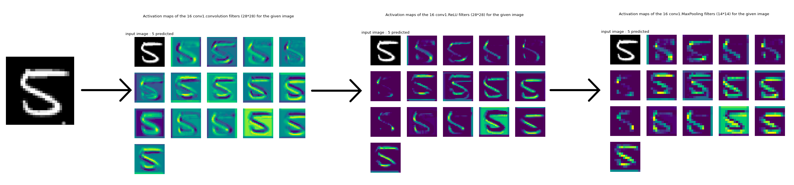

<!-- PROJECT LOGO -->
<br />

<h1 align="left">Activation maps visualizer for PyTorch</h1>

TODO : Add image


<!-- TABLE OF CONTENTS -->
<details open="open">
  <summary>Table of Contents</summary>
  <ol>
    <li>
      <a href="#about-the-project">About The Project</a>
      <ul>
        <li><a href="#built-with">Built With</a></li>
      </ul>
    </li>
    <li>
      <a href="#getting-started">Getting Started</a>
      <ul>
        <li><a href="#prerequisites">Prerequisites</a></li>
        <li><a href="#installation">Installation</a></li>
      </ul>
    </li>
    <li>
    <a href="#usage">Usage</a>
      <ul>
          <li><a href="#try-demorestnet18.py">Try demoRestNet18.py</a></li>
          <li><a href="#use-activationmapextractor.py">Use ActivationMapExtractor.py</a></li>
      </ul>
    </li>
    <li><a href="#contributing">Contributing</a></li>
    <li><a href="#license">License</a></li>
    <li><a href="#todo-list">Todo list</a></li>
  </ol>
</details>


<!-- ABOUT THE PROJECT -->
## About The Project

_This personal project is still in progress_

I've always been curious on what's going on in the different layers of CNNs. That's why I've created a little PyTorch script to see the activation maps of a specific, or all the CNN's layers. 
Moreover, since I'm trying to switch from Tensorflow/Keras to PyTorch, I thought it would be interesting to do this little project to get used to handling torch objects and tensors.

<p align="center">
    
</p>

### Built With

* [Python 3.8](https://www.python.org/)
* [PyTorch](https://pytorch.org/)
* [Matplotlib](https://matplotlib.org)


<!-- GETTING STARTED -->
## Getting Started

To get a local copy up and running follow these simple example steps.

### Prerequisites

* Python  ⩾ 3.8
  ```sh
  sudo apt install python3 python3-pip
  ```

### Installation


1. Clone the repo
   ```sh
   git clone https://github.com/Clement-W/Activation-Maps-Visualiser-PT.git
   cd Activation-Maps-Visualiser-PT/
   ```
3. Create and activate a virtual environment
   ```sh
   pip3 install virtualenv --upgrade
   virtualenv venv
   source venv/bin/activate
   ```
4. Install the requirements
   ```sh
   pip3 install -r requirements.txt
   ```


<!-- USAGE EXAMPLES -->
## Usage


### Try demoRestNet18.py

TODO


### Use ActivationMapExtractor.py

TODO


_For more examples, please refer to the [Documentation](TODO)_
TODO

<!-- CONTRIBUTING -->
## Contributing

I'm still learning PyTorch, so feel free to use Issues or PR to report errors and/or propose additions or corrections to my code. Any contributions you make are **greatly appreciated**.


<!-- LICENSE -->
## License

Distributed under the MIT License. See `LICENSE` for more information.


<!-- TODO LIST -->
## Todo list
TODO 


